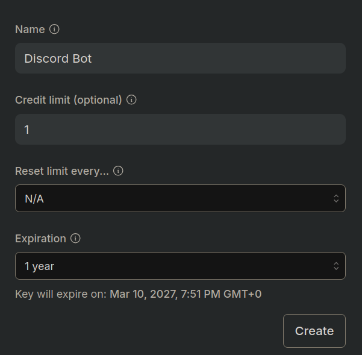
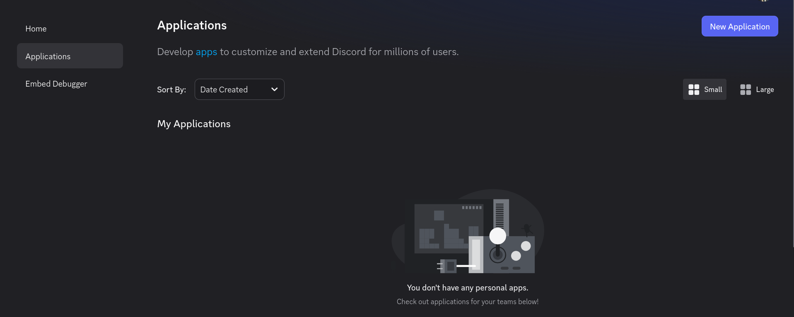
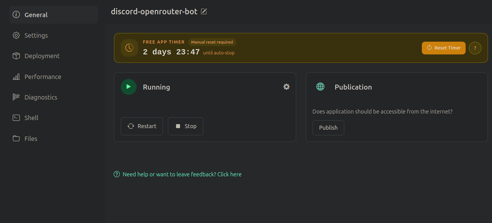

# DiscordBotChat

## What is this

This Discord ChatBot uses an LLM, via OpenRouter, to communicate with Discord users when mentioned.

The model used is llama-3.3-70b-instruct by Meta. It has a large number of parameters and is fine-tuned for instructions, making it decent for this chatbot purpose. Plus its 'flexibility' on wording makes it great to have in a server with friends, due to some interesting answers it may provide. It also supports many languages.

## Setup

### OpenRouter

To have access to the LLM my recommendation is OpenRouter (which is what this project uses).

To get an API key for the bot go to [openrouter](openrouter.ai) and create an account.

After creating an account, navigate to settings and to the [API keys tab](openrouter.ai/settings/keys) (or click here).

Click on the 'Create button', give the key a meaningful name and set credit limits and expirations. Note that the code 
in this repository uses a free version of the model that consumes no credits (no money) but it has a daily limit of 50 requests.
To 'avoid' this limit you can use the paid model, but after spending the equivalent to $1 in credits you will be 
required to pay.



To change for the paid model (or change to another model you can find in the Documentation of OpenRouter) change the 
following code:

```
payload = {
        "model": "meta-llama/llama-3.3-70b-instruct:free",
        "messages": [
            {"role": "system", "content": prompt}
        ],
        "max_tokens": 200,
        "temperature": 0.7
    }
```

to:

```
payload = {
        "model": "meta-llama/llama-3.3-70b-instruct",
        "messages": [
            {"role": "system", "content": prompt}
        ],
        "max_tokens": 200,
        "temperature": 0.7
    }
```

After following all steps make sure you store your API key (you may not have access to it again) to then keep in the 
.env file.

### Discord Developer Portal

To create a bot in Discord, first you need a Discord account, and then you need to access the [Discord Developer Portal](https://discord.com/developers/home).



Then, use the create button to create a new app for your bot.

Fill the name, description and upload an icon as you wish, that is the data that will appear on Discord.

For the bot to be able to read and send messages you need to go to the 'Bot' tab in your application, and allow the 
'Message Content Intent', without this it will not work.

You will also need to obtain the 'Token', also found in the 'Bot' tab and store as this will be required for the 
application to work.

With this you can use the link in the 'Installation' tab or create your own and add the bot to where you want.

## Running the Bot

You can either host it yourself or use online platforms to host it continuously (usually the best option).

### External Hosting

My go to for small applications like this is [JustRunMy.App](justrunmy.app).

Using this all you have to do is create an account, create an application, provide the .zip with the code (the .py files and the .txt files are both required, not the others)
And make sure that the secrets are all there. 

The site agent automatically detects secrets, but sometimes it misses some. Make sure there are 2 secrets. Their names 
are found in the .env.example file.

And that should be it. It should run the bot by now. 

The only issue is that the free tier requires you to reset a timer 
each 3 days otherwise the app shuts down, but if that happens all you need to do is go to the website and restart. 



### Self-host

To self-host the bot you will need to have Python installed in your system. 

There are many tutorials online on how to do it. You should install Python and Pip.

After installing them, make sure to install the required packages:

```
pip install -r requirements.txt
```

Note that this command may differ based on your system and/or installation, but I am assuming that if someone goes this 
path, they have enough 'tech literacy' to figure this out on their own.

You also need to make sure you have the '.env' file correct. Its structure is depicted in the '.env.example' file. The 
values for each secret are the ones mentioned earlier that you should've kept.

Then to run, either run with an IDE or via command line with:

```
python bot.py
```

(Again the exact command may differ)

## Usage

To update the instructions, change the instructions.txt file as you wish.
(If using JustRunMy.App, you can navigate to the files on your application and click on the edit button)
Then restart the app if it was running for the changes to work.

By now everything should be correct (or almost) so you should have an online bot on your server. To use it, mention it 
or reply to a bot reply for it to answer you.

It is important to note that for the sake of not exploding the API token usage, each message is individual, it does not 
know about previous messages.

